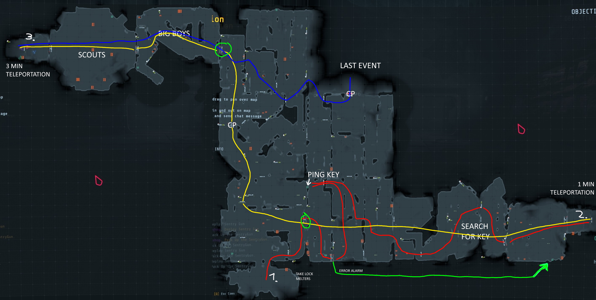

# Rundown 6

## A1

There is a little cut in the image at the top. You will find there a big room with story and the extraction point, which you have to defend for a few minutes. So be prepared to defend the extraction room.

[Guide](https://youtu.be/9XijRULTI-Y)

## B1

[Guide](https://www.youtube.com/watch?v=UIR_63PuFgM)

## B2

[Guide](https://www.youtube.com/watch?v=SzjXtgRVRlw)

## C1

[Guide](https://www.youtube.com/watch?v=55G3WmkHgHM)

## C2

[Guide](https://www.youtube.com/watch?v=lIMGgl3P9zA)

## C3

[Guide]()

## D1

[Guide](https://www.youtube.com/watch?v=fvaw2DHltvc)

## D2

[Guide]()

## D3

[Guide]()

## D4

[Guide]()